# Azure Compute and Identity Management (RBAC-Focused)


> An end-to-end lab that deploys a virtual machine and then secures it the way a real organization would: using **role-based access control (RBAC)**, an **Entra ID group**, and **least privilege** as the backbone. The compute piece is the stage. Identity and access management is the actual story.

---

## Table of Contents

1. [Overview](#overview)
2. [Why This Is an IAM Project](#why-this-is-an-iam-project)
3. [Skills Demonstrated](#skills-demonstrated)
4. [Architecture](#architecture)
5. [Prerequisites](#prerequisites)
6. [Part 1: Deploy the Virtual Machine](#part-1-deploy-the-virtual-machine)
7. [Part 2: Secure the Key with Key Vault and RBAC](#part-2-secure-the-key-with-key-vault-and-rbac)
8. [Part 3: Log In and Prove the NSG Works](#part-3-log-in-and-prove-the-nsg-works)
9. [Part 4: Governance with an Azure Policy Initiative](#part-4-governance-with-an-azure-policy-initiative)
10. [Part 5: Cost Management](#part-5-cost-management)
11. [Roadblocks and How I Fixed Them](#roadblocks-and-how-i-fixed-them)
12. [Cleanup](#cleanup)
13. [Future Enhancement: Just-in-Time Access with PIM](#future-enhancement-just-in-time-access-with-pim)
14. [Key Takeaways](#key-takeaways)

---

## Overview

This project simulates a common real-world task. A company needs a virtual machine for a web application, but it cannot just be spun up. It has to be deployed **securely** and **governed**. I provisioned the compute, then applied the identity, access, and governance controls a cloud or security engineer is expected to know, and I proved each control actually works rather than assuming it.

**Time to complete:** roughly one hour
**Real cost:** a few cents, because everything was torn down the same day (see [Cleanup](#cleanup))

---

## Why This Is an IAM Project

It would be easy to look at this and call it a "VM project." It is not. Almost every decision here is an identity and access management decision:

- The VM authenticates with an **SSH key pair**, not a password, because a key cannot be brute-forced the way a password can.
- That private key is not left on my laptop. It is moved into **Key Vault**, an access-controlled, audited store.
- Access to the vault and the VM is granted through an **Entra ID security group** with **scoped RBAC roles**, not handed to individuals.
- The roles chosen follow **least privilege**: each identity gets the minimum permission needed for its job and nothing more.
- **Separation of duties** shows up directly: "who can manage the VM" and "who can read the SSH key" are two different grants at two different scopes.
- **Azure Policy** then enforces governance rules automatically across the subscription, which is access control applied to the deployment layer itself.

RBAC is the thread running through all five parts.

---

## Skills Demonstrated

- Provisioning IaaS compute (virtual machine, managed data disk, static private IP)
- Network filtering with a **Network Security Group (NSG)**
- **RBAC** and least privilege through **Entra ID groups**
- Secret protection with **Azure Key Vault** using the RBAC permission model
- Governance at scale with a custom **Azure Policy initiative** (tag inheritance plus allowed resource types)
- **Cost Management** budgets, alerting, and optimization with Advisor
- Live troubleshooting of real portal and CLI failures

---

## Architecture

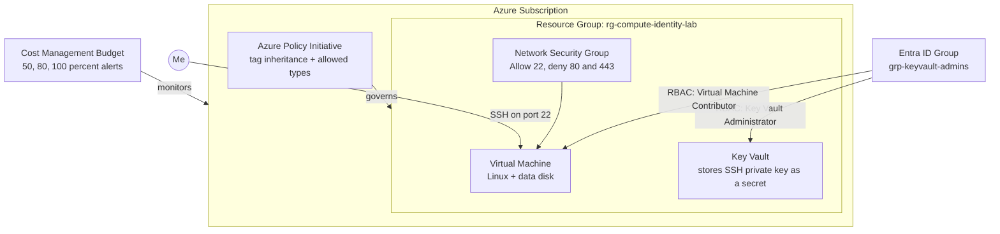
```mermaid
flowchart TD
    subgraph SUB["Azure Subscription"]
        POL["Azure Policy Initiative<br/>tag inheritance + allowed types"]
        subgraph RG["Resource Group: rg-compute-identity-lab"]
            VM["Virtual Machine<br/>Linux + data disk"]
            NSG["Network Security Group<br/>Allow 22, deny 80 and 443"]
            KV["Key Vault<br/>stores SSH private key as a secret"]
        end
    end
    ENTRA["Entra ID Group<br/>grp-keyvault-admins"]
    BUDGET["Cost Management Budget<br/>50, 80, 100 percent alerts"]

    ENTRA -->|RBAC: Key Vault Administrator| KV
    ENTRA -->|RBAC: Virtual Machine Contributor| VM
    NSG --> VM
    POL -->|governs| RG
    BUDGET -->|monitors| SUB
    User(("Me")) -->|SSH on port 22| VM
```

---

## Prerequisites

- An Azure subscription with permission to assign roles and policies (Owner, or Contributor plus User Access Administrator)
- Microsoft Entra ID (an Entra ID P2 license unlocks the optional [PIM enhancement](#future-enhancement-just-in-time-access-with-pim))
- Azure CLI, or the in-portal Cloud Shell
- A terminal that supports SSH (macOS and Linux have this built in)

> Tip: put every resource in one dedicated resource group. It makes cleanup a single action and keeps the RBAC and Policy scopes tidy.

---

## Part 1: Deploy the Virtual Machine

**Goal:** stand up a Linux VM with an extra data disk, a static private IP, and an NSG that only permits SSH.

### 1.1 Create the resource group

A resource group is a logical container and a lifecycle boundary. Everything in this lab lives inside it, so at the end a single delete removes it all. It is also the scope that RBAC and the "inherit a tag from the resource group" policy attach to later, so a clean single group matters.

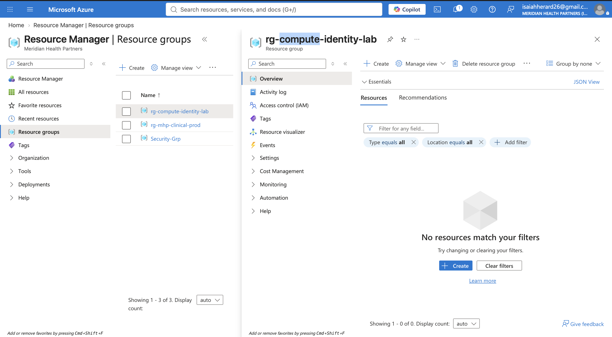

### 1.2 Create the VM (Basics)

I chose Ubuntu Server, a small burstable size, and **SSH public key** authentication with a newly generated key pair.

The IAM point here is the choice of SSH keys over passwords. Azure keeps the public key on the VM and hands me the private key. Whoever holds that private key can log in, which is the exact reason it gets vaulted in Part 2 instead of living in a Downloads folder.

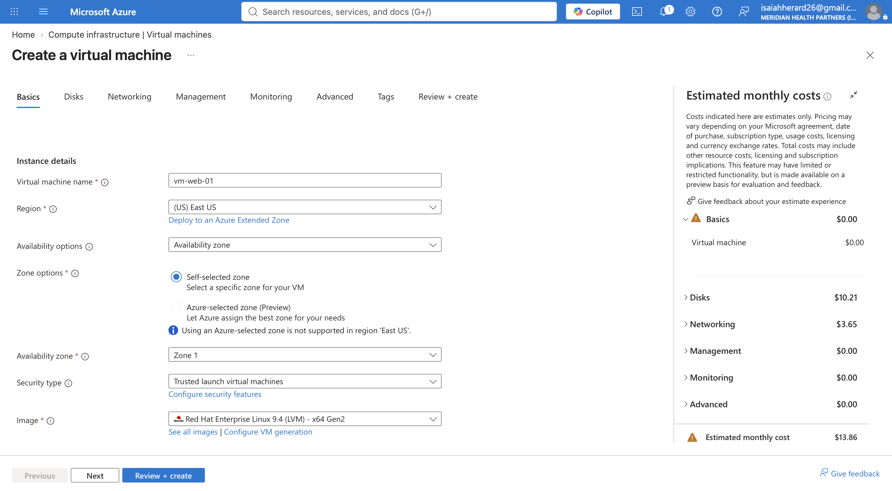

### 1.3 Add a data disk

Under Data disks I created and attached a new disk with **Source type: None**, which creates a blank managed disk. The alternative, Storage blob, would import an existing VHD from outside Azure. For a fresh lab, None is correct.

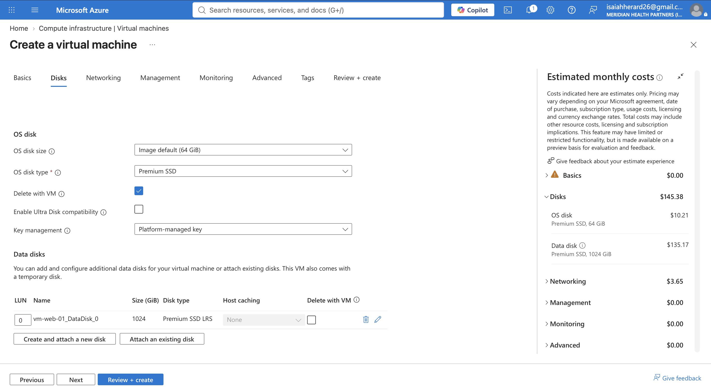

### 1.4 Lock down the network

On the Networking tab I set the NIC network security group to **Basic** and allowed only **SSH (port 22)** inbound. Nothing on 80 or 443.

The three NSG options are worth knowing:
- **None:** you manage the NIC or NSG yourself
- **Basic:** quick, simple deployments like this lab
- **Advanced:** attach a prebuilt NSG for fine-grained production control

By allowing only port 22, I built the exact condition tested in Part 3: SSH works, web traffic does not.

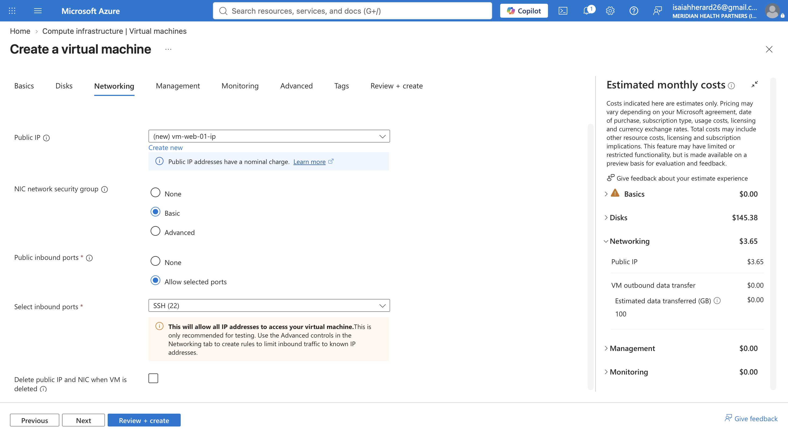

### 1.5 Create and download the private key

After validation I created the VM and downloaded the private key file. That file is treated like a password. Protecting it is the whole reason Part 2 exists.

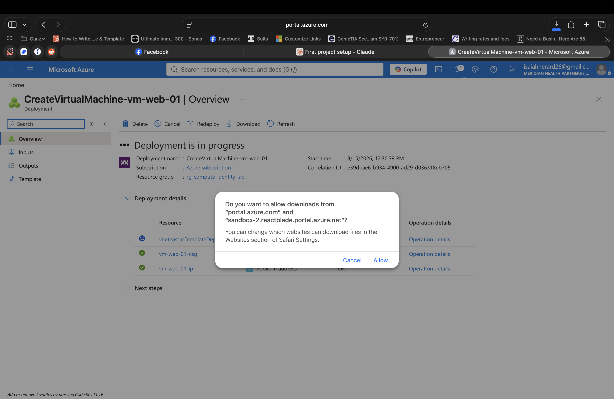

---

## Part 2: Secure the Key with Key Vault and RBAC

**Goal:** get the private key off the laptop and into an audited store, and control access with a group and scoped RBAC roles instead of handing out permissions directly.

### 2.1 Create the Key Vault

Created in the same resource group and same region as the VM. The important setting is on the Access configuration tab: the permission model is set to **Azure role-based access control (RBAC)**, not the legacy vault access policy model. This is what makes the RBAC role assignments in the next steps actually govern who can read the key.

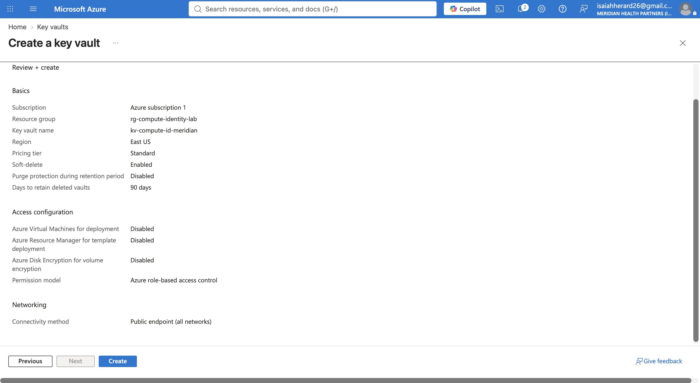

### 2.2 Create an Entra ID security group

Created a security group named `grp-keyvault-admins` and added myself as owner and member.

Assigning roles to a group instead of an individual is a core identity governance principle. If three engineers needed access next month, they would be added to the group and inherit everything. Without a group, roles would be hand-assigned per person per resource, which drifts into an unauditable mess. I am the only member today, but it is built the right way.

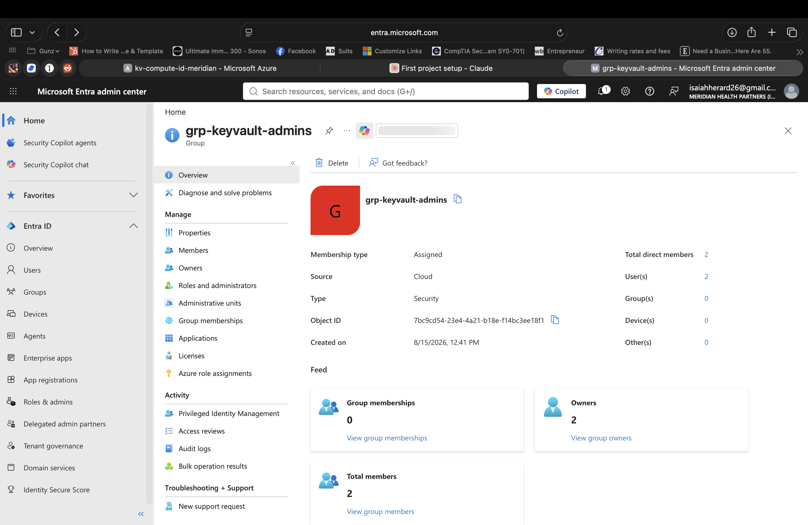

### 2.3 Assign the Key Vault role (least privilege)

On the vault's Access control (IAM) blade I assigned **Key Vault Administrator** to the group.

Least privilege in action: the group was not given Owner or Contributor over the whole vault. It got exactly the role needed to manage keys and secrets, nothing wider.

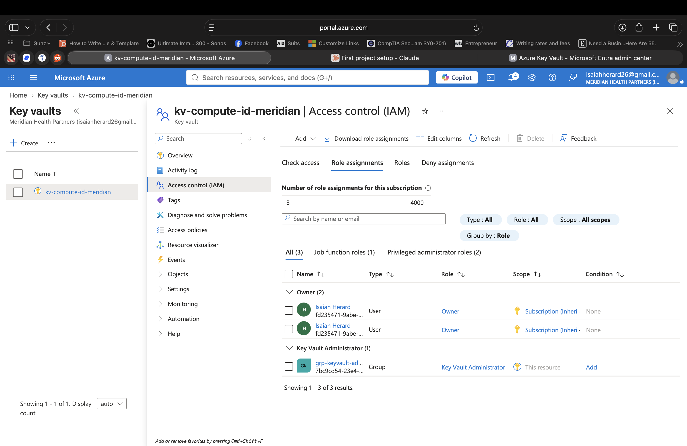

### 2.4 Store the private key as a secret

Key Vault "Keys" and "Secrets" are different objects. Keys are cryptographic objects the vault performs operations with. A raw private-key file belongs in **Secrets**. I created a secret named `vm-web-01-ssh-key` and pasted the full contents of the .pem file, including the BEGIN and END lines.

The key now lives in an audited, access-controlled store. It could be deleted from the laptop entirely and still retrieved, and every access is logged.

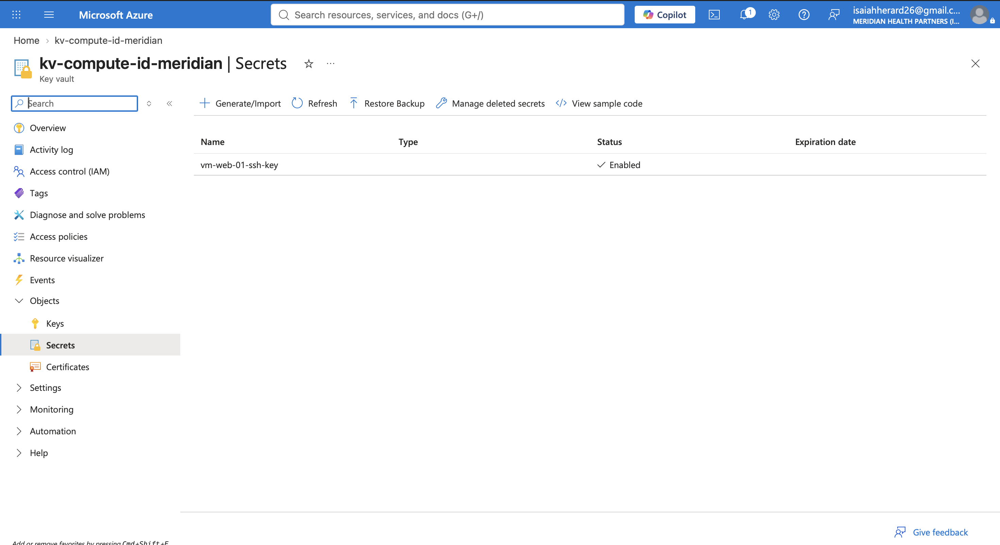

### 2.5 Assign Virtual Machine Contributor on the VM

A second, separate RBAC assignment, this time on the VM: **Virtual Machine Contributor** granted to the same group.

This is separation of duties made concrete. There are now two different roles at two different scopes. Virtual Machine Contributor lets an identity start, stop, resize, and manage the VM, but it does not grant login as a user and it does not grant any access to the key in the vault. Different resource, different permission.

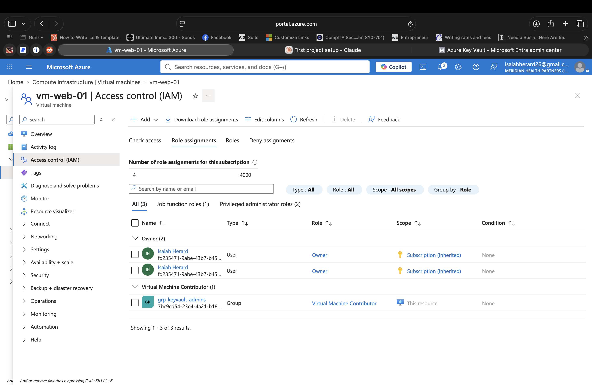

### 2.6 Verify the access

Confirmed group membership in Entra ID and cross-checked the role assignments on both the Key Vault and the VM. The "Check access" feature answers the auditor's question directly: what can this identity actually do here.

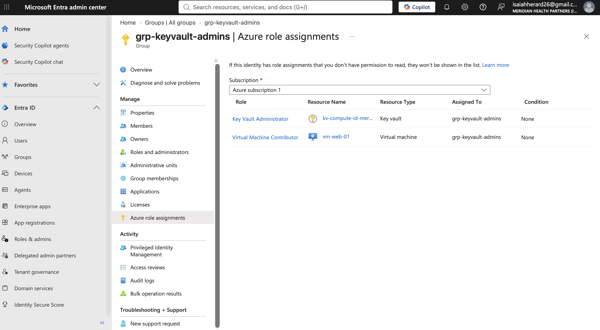

---

## Part 3: Log In and Prove the NSG Works

**Goal:** log in over SSH, then demonstrate that the NSG blocks everything except port 22.

### 3.1 Find the public IP

Ran the following to locate the VM's public IP:

```bash
az network public-ip list --output table
```

The output returned the address `20.42.80.204` for `vm-web-01-ip`.


### 3.2 SSH into the VM

Connected from the local terminal using the downloaded key, after tightening its permissions so SSH would accept it:

```bash
chmod 600 ~/Downloads/vm-web-01_key.pem
ssh -i ~/Downloads/vm-web-01_key.pem azureuser@20.42.80.204
```

Confirmed I was actually on the VM with `hostname`, and used `lsblk` to show the attached data disk from Part 1.

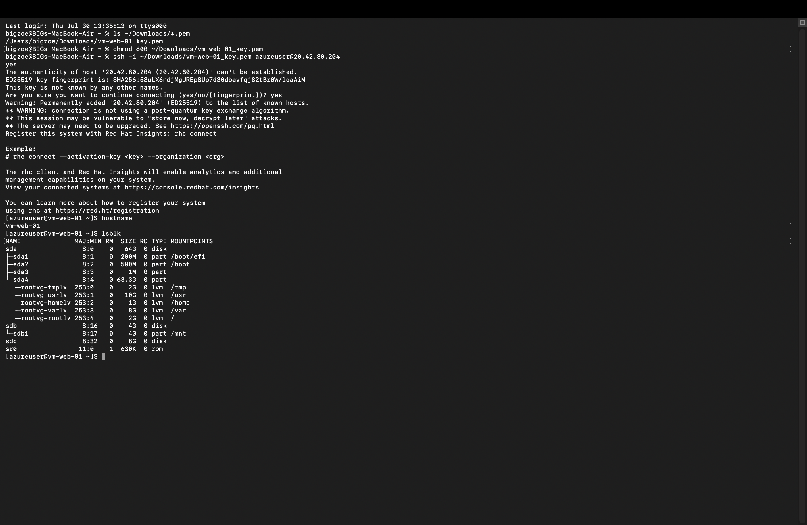

### 3.3 Prove the NSG is filtering traffic

With the SSH session still open, I browsed to `http://20.42.80.204` and the connection **hung and timed out**.

That failure is the point. The NSG allows only port 22, so nothing answers on port 80. The same IP that accepted the SSH session silently drops the browser request. Same machine, two outcomes, and the only variable is the NSG rule. The connection hangs rather than showing "connection refused" because the NSG drops the packets instead of rejecting them, so it looks like silence.

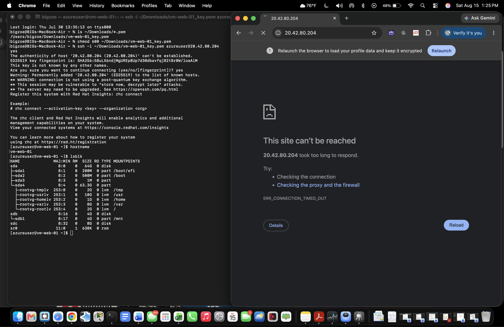

---

## Part 4: Governance with an Azure Policy Initiative

**Goal:** bundle several policies into one initiative that auto-inherits a tag and restricts which resource types can be deployed, then assign it and check compliance.

Securing one VM by hand does not scale. Azure Policy enforces rules automatically across a whole scope, both proactively (blocking noncompliant deployments) and continuously (flagging drift). This is access control applied to the deployment layer.

Vocabulary that makes the clicks make sense:
- **Policy definition:** one rule
- **Initiative:** a bundle of definitions managed and assigned as one unit
- **Assignment:** pointing a definition or initiative at a scope so it takes effect
- **Parameter:** a value left blank in the definition and supplied at assignment time, so the initiative is reusable
- **Effect:** what the policy does, such as Deny, Audit, or Modify

### 4.1 Start the initiative definition

Created a new initiative under Policy, Authoring, Definitions, with a name and a new category.

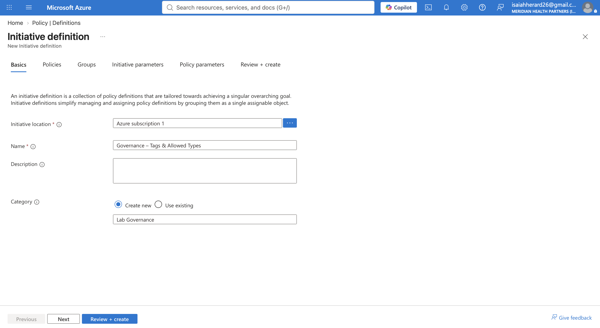

### 4.2 Add the policy definitions

Added three built-in definitions to the bundle:
- Inherit a tag from the resource group (Modify effect)
- Inherit a tag from the subscription (Modify effect)
- Allowed resource types (Deny effect)

Together they auto-stamp a tag for ownership and cost tracking, and block anything off the approved list.

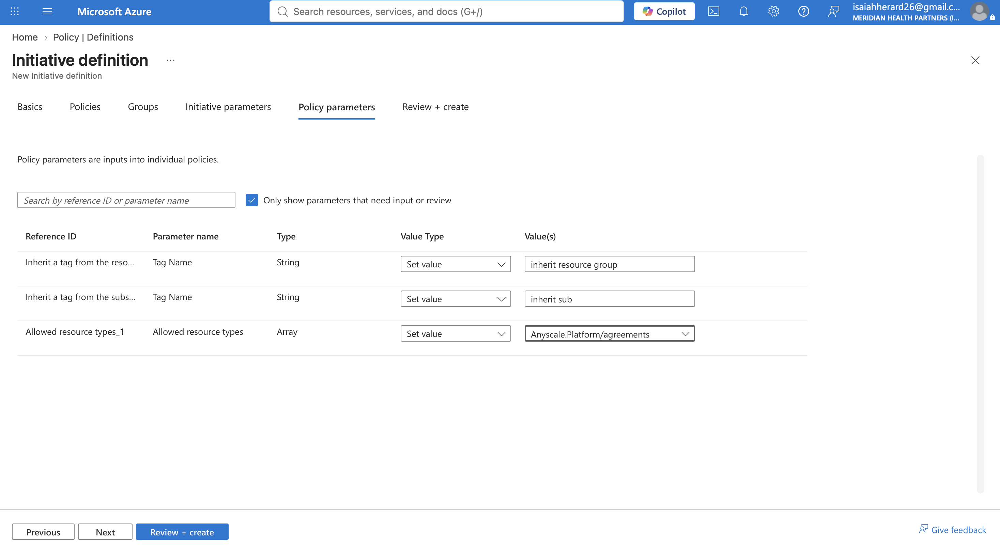

### 4.3 Create the initiative parameter

Declared an initiative parameter named `tagName` of type String so the tag can be chosen at assignment time rather than hard-coded.

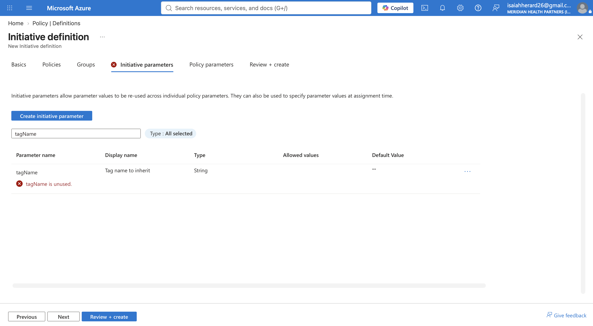

### 4.4 Wire the policies to the parameter

On the Policy parameters tab, both "inherit a tag" policies were set to **Use Initiative Parameter** pointing at `tagName`. Allowed resource types was given the approved list, including the supporting types a VM actually needs to deploy:

```
Microsoft.Compute/virtualMachines
Microsoft.Compute/disks
Microsoft.Network/networkInterfaces
Microsoft.Network/networkSecurityGroups
Microsoft.Network/publicIPAddresses
Microsoft.Network/virtualNetworks
```

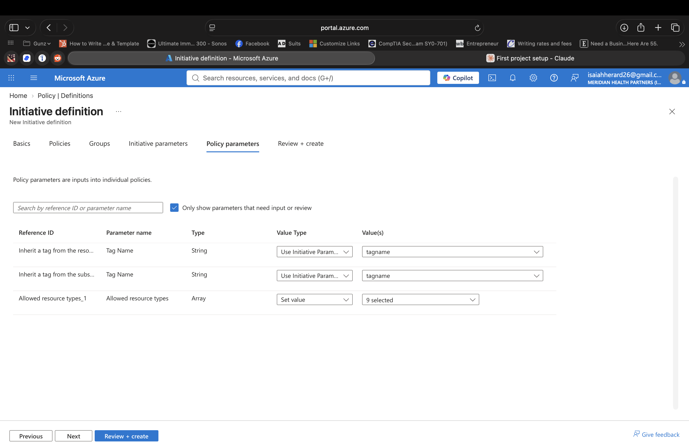

### 4.5 Assign the initiative

Assigned the finished initiative to the scope and supplied the tag name (for example `Environment`) at assignment time.

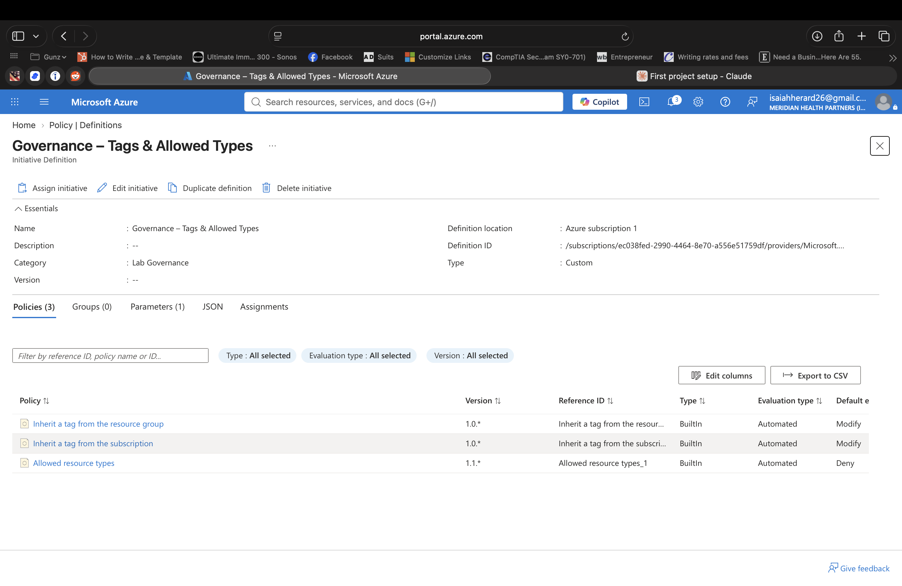

### 4.6 Check compliance

Compliance evaluation is not instant and can take several minutes. It is viewable under Policy, Compliance, and also on the VM under Operations, Policies.

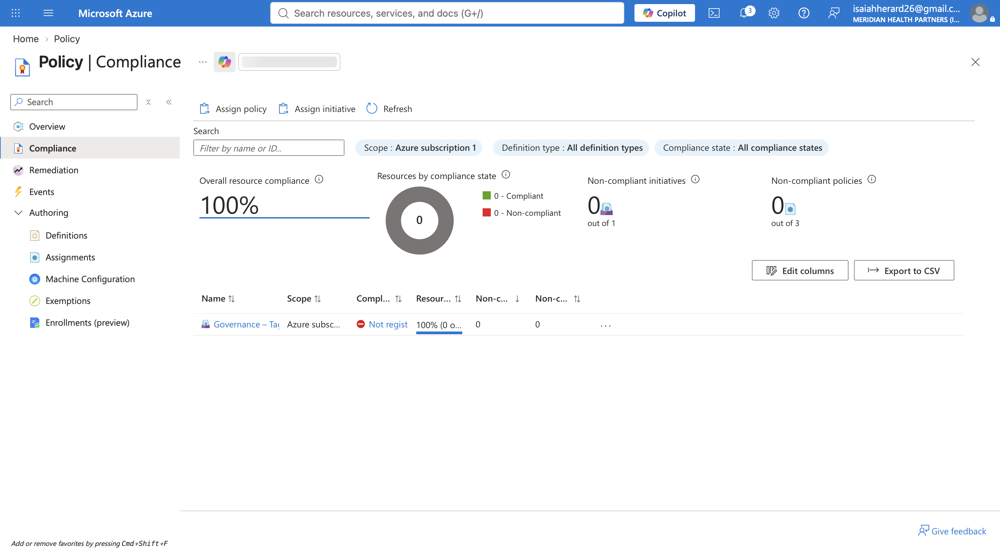

---

## Part 5: Cost Management

**Goal:** put a budget and alerts around spend so nothing runs away, and use Advisor to spot savings.

### 5.1 Create a budget

Under Cost Management, Budgets, I created a monthly budget with alert thresholds at 50, 80, and 100 percent, delivered by email.

An important nuance: a budget alerts, it does not cap or shut anything off. It is a smoke detector, not a circuit breaker. Actual auto-shutdown would require wiring the alert to an Action Group that triggers automation.

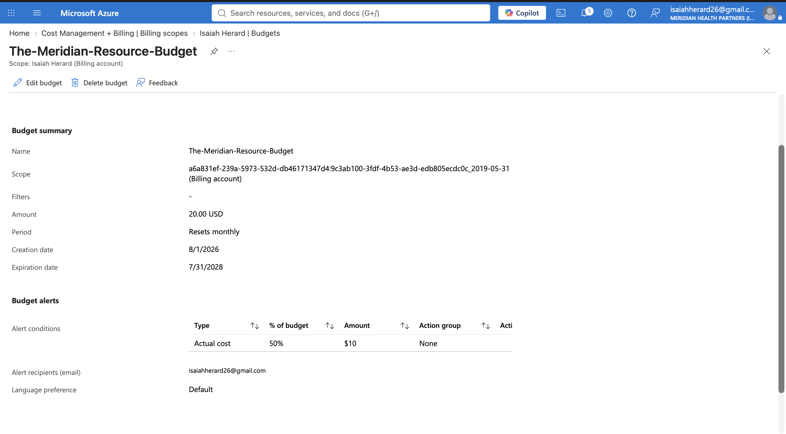

### 5.2 Analyze and optimize

Used Cost analysis grouped by service and resource to see where spend concentrates, and reviewed Advisor's Cost recommendations for right-sizing and idle resources.

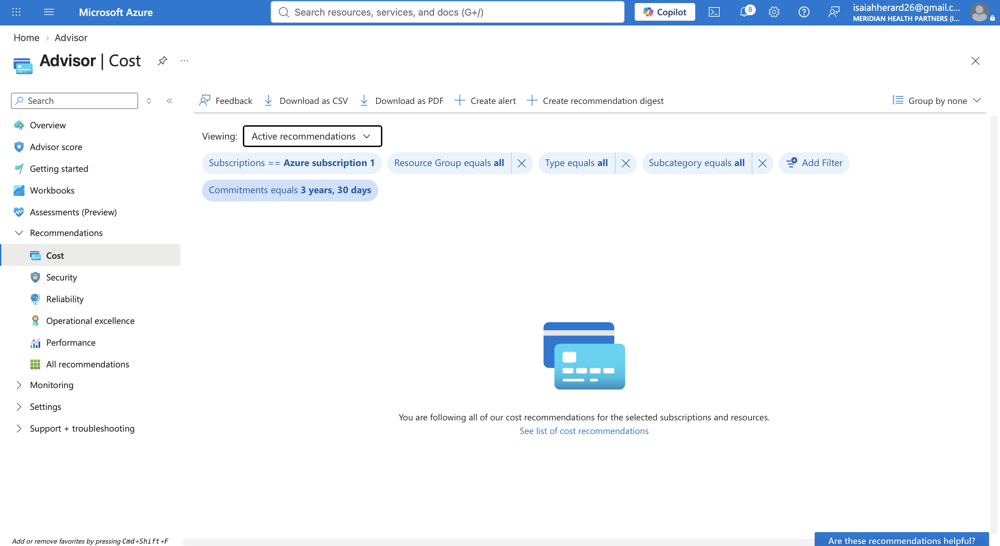

---

## Roadblocks and How I Fixed Them

The real learning happened here. These are the actual failures I hit and how I resolved each one.

### Roadblock 1: "The subscription is missing" when creating the resource group

The Subscription dropdown visually displayed a subscription, but the form still errored saying it was missing. The value was showing as a default without being committed as a selection, so validation treated the field as empty.

**Fix:** I opened the dropdown and actively clicked the subscription to select it. The error cleared. Lesson: a field showing a default value is not the same as a selected value.

### Roadblock 2: A VM cost estimate of about 150 dollars per month

The estimate looked alarming until I broke it into line items. The compute was fine. The disks were about 145 dollars because they defaulted to Premium SSD at a large size, and the public IP added a few dollars.

**Fix:** I changed the OS and data disks to Standard and shrank the data disk to the smallest size. The estimate dropped into low single digits per month. Two lessons stuck: the monthly figure is a projected rate for running 24/7, not an upfront charge (Azure bills per second while running), and when a cost looks scary you break it into VM versus disk versus network, because the culprit is almost always a default larger than you need.

### Roadblock 3: SSH failing with "no such file or directory"

Two problems stacked. First I typed the placeholder angle brackets literally, so bash threw a syntax error near an unexpected token. Then, after removing the brackets, SSH could not find the key file. The reason was that I was running the command inside Cloud Shell, which is an ephemeral Linux environment in Azure that cannot see files on my Mac. My key lived in the Mac's Downloads folder.

**Fix:** I ran SSH from the Mac's own terminal instead, set the key permissions with `chmod 600`, and connected with the real IP and real path. Lesson: Cloud Shell storage is separate from the local machine, so local files are not visible there.

### Roadblock 4: Initiative parameter stuck on "unused," plus a duplicate

The Initiative parameters tab flagged the parameter as unused, and I had accidentally created two, `tagName` and `tagname`.

**Fix:** I removed the duplicate, then completed the wiring on the Policy parameters tab so a policy actually referenced the parameter. The "unused" warning cleared once it was referenced. Lesson: a parameter has two halves on two different tabs. Declaring it on the Initiative parameters tab creates the variable, and referencing it on the Policy parameters tab is what gives it a job. "Unused" simply means the second half is not done yet.

---

## Cleanup

To stop all billing, the entire resource group was deleted in one command:

```bash
az group delete --name rg-compute-identity-lab --yes --no-wait
```

If the policy assignment or budget were scoped at the subscription level rather than the resource group, they are removed separately (Policy, Assignments and Cost Management, Budgets). Managed disks keep charging even after a VM is deallocated, so deleting the whole group is the clean way to make sure nothing lingers.

---

## Future Enhancement: Just-in-Time Access with PIM

With an Entra ID P2 license, the RBAC story can be strengthened using Privileged Identity Management. Instead of the roles being permanently active, they can be made **eligible**, so an identity activates the role only when needed, for a limited window, optionally requiring justification, approval, and MFA. That turns standing access into just-in-time access, which is the strongest expression of least privilege and a natural next step for this project.

---

## Key Takeaways

- A VM is not finished when it boots. Network filtering, identity, key protection, governance, and cost controls are what make it production-appropriate.
- RBAC combined with Entra groups beats handing out credentials. Access becomes a membership change and follows least privilege.
- Separation of duties is real and visible here: managing the VM and reading its key are two distinct grants at two distinct scopes.
- Key Vault removes secrets from laptops, configs, and chat logs, and logs every access.
- Azure Policy initiatives enforce standards automatically as an environment grows, which is access control at the deployment layer.
- Budgets and Advisor turn cost from a monthly surprise into a monitored, optimized metric.

---

### Repo structure

```
azure-compute-identity-management/
├── README.md
└── screenshots/
    ├── 01-create-resource-group.png
    ├── 02-vm-basics.png
    ├── 03-data-disk.png
    ├── 04-networking-nsg.png
    ├── 05-download-private-key.png
    ├── 06-create-key-vault.png
    ├── 07-entra-group.png
    ├── 08-kv-role-assignment.png
    ├── 09-import-key.png
    ├── 10-vm-role-assignment.png
    ├── 11-verify-rbac.png
    ├── 12-public-ip-list.png
    ├── 13-ssh-connect.png
    ├── 14-nsg-block-http.png
    ├── 15-initiative-basics.png
    ├── 16-add-definitions.png
    ├── 17-initiative-parameters.png
    ├── 18-wire-parameters.png
    ├── 19-assign-initiative.png
    ├── 20-policy-compliance.png
    ├── 21-budget.png
    └── 22-cost-analysis.png
```
